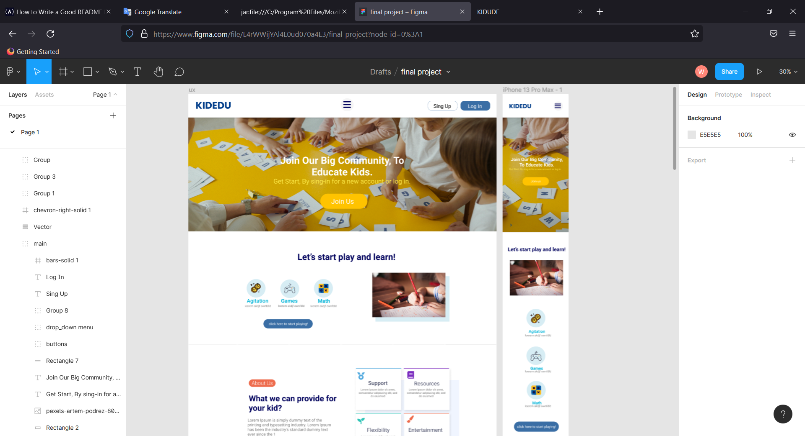
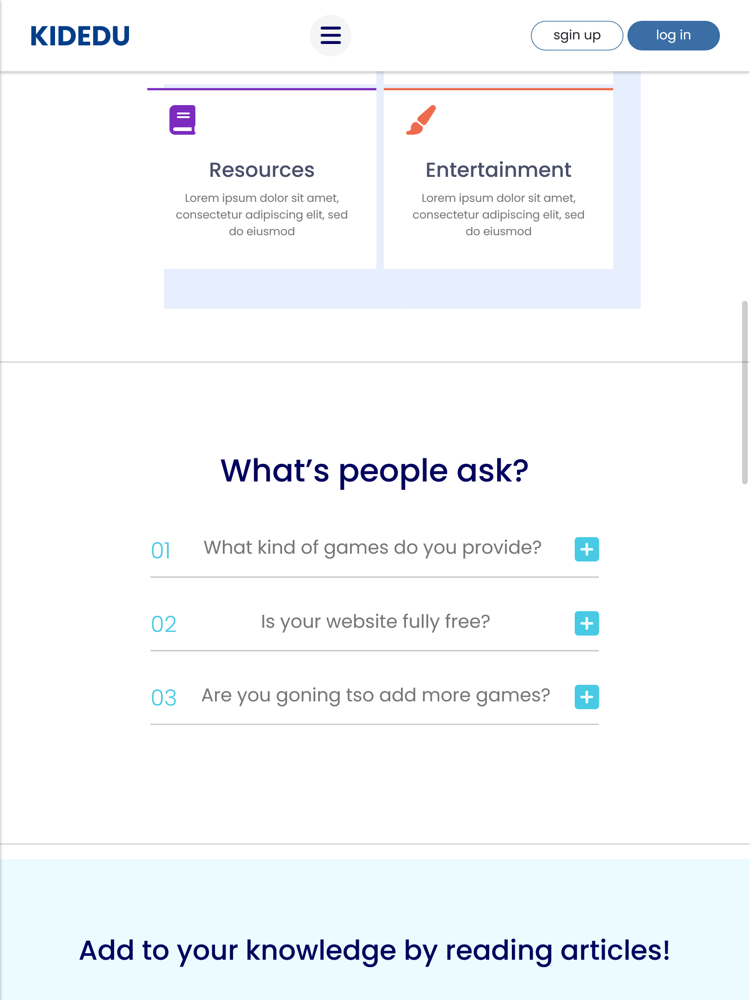
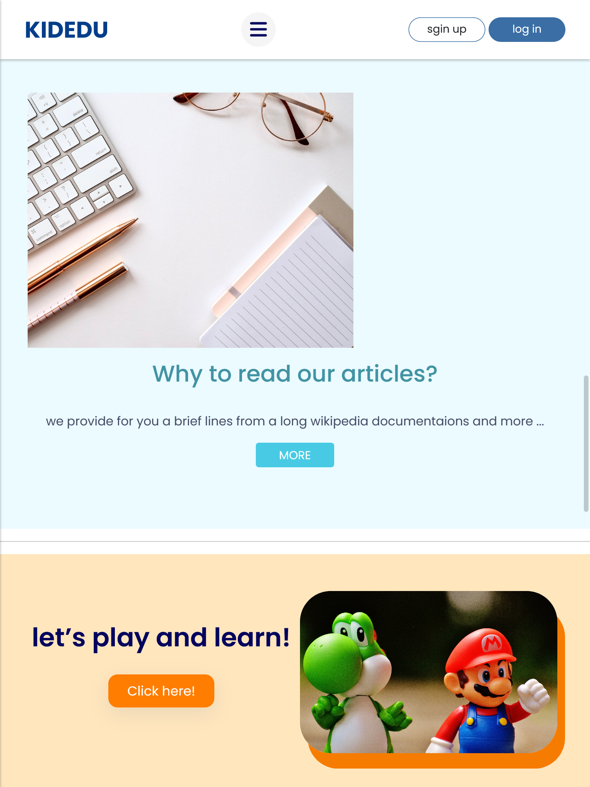
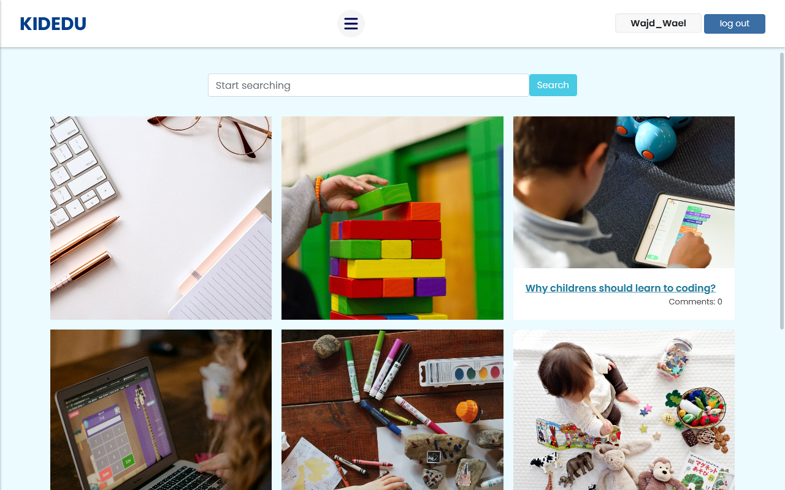
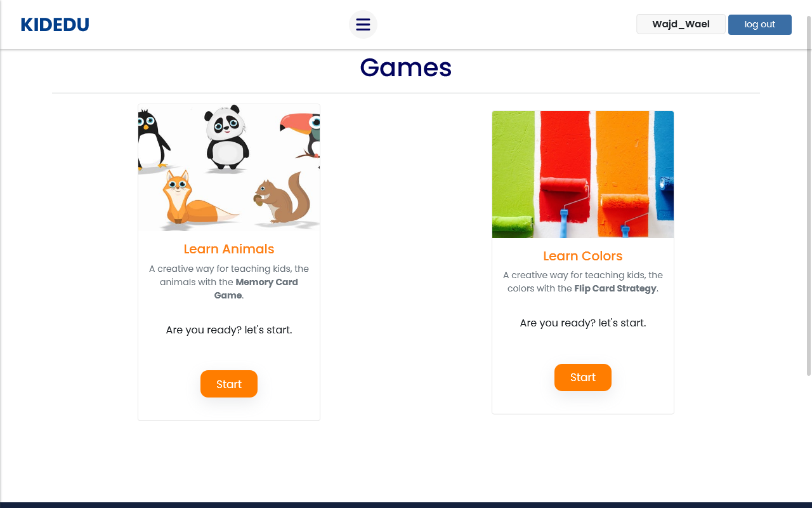

# KIDEDU

---

##### The Final Project (Capstone) for CS50's Harvard University course, "Web programming with Python and Javascript".

# What I have done?

simply I made up a project talking about one of the online organizations for educating kids from my own imagination I designed the landing page (UI/UX) using Figma

# what is my project about? (Distinctiveness and Complexity)

## The core idea of my project is :

###### my project gives the ability for the users to

---

        1. Registers, login
        2. Play games, read articles
        3. Comment on the article as well
        4. search about particular article
        5. Take a snapshot of what this web app talks about from the sections on the main page,

> sections of the main page:

- The user can read people questions from the section of "What's people ask?" and reads it's answers
  

- Also you cant see the main features of the web app inside the main page

- There is in the index page a section to the team as well.

- finally there is a section for the testimonials,don't forget there are two sections to represent tow links for the games and articles links, furthermore there is a footer as well to make the process faster.

  

# What are the advantages of my project as well?

### 1- if you are a parent and you want to find somethings helping you to improve your kid skills you might go **into the articles linked in the navbar**, we have 6 articles a snap shortcut of Wikipedia topics

### 2- if you are a kid and you want **to play and learn** at the same time you might go to the games linked in the navbar, it contains games for kids

# What do your files represent in the repo?

> Let's start talking about the **main files**:

- 1-(view.py) file: in this file, I have 10 views,
  3 for registering the user one for the main and 3 for the articles page (view-article-page, comments, and the main article page) also 3 views for games (one for the main page, one for the first game and second game view),

- 2- (url.py) file: contains 10 URLs to each view,

- 3- (models.py) file: we have 3 models (one for articles, one for comment, one for colors game)

- 4- (forms.py) file: contains 3 forms one for register, the second for comment
  as well.

- 5- (admin.py) file: contains 3 admin sites for the 3 models

- 6- (script.js) file: I have a single Javascript file that contains a bunch of code for the front-end of the project, (Navbar Slidebar, Memory Game, Q and A section, Testimonials section, random images slider script)

for sure I don't forget the styles file, I have 2 files for the page style

- the (main.css) file: represent the styles for the layout page of the project.
- the (styles.css) represent the styles for the whole project sections and pages.

we have a lot of images, I threw them into the

- (image folder) beside the js file and CSS files at the static file of the project

so what's about the Html files?,

# Templates Folder:

- I have also a folder called Templates I threw into it a bunch of HTML files for each view
- 1- (layout.html) For the layout structure of the project
- 2- (index.html) For the main Landing page of the project
- 3- (register.html) For registering the user
- 4- (lgoin.html) For log the user in
- 5- (articles.html) For represent all the articles
- 6- (view-page.html) For viewing every single article content
- 7- (games.html) For represent all the games
- 8- (game_1.html) For represent the memory card game
- 9- (colors.html) For represent the color filp card game

# How to run this project? (Getting Started)

##### start with passing those codes.

        1- open your terminal or cmd on windows, after cloning this project on your device.
        2- Run python manage.py makemigrations kidedu.
        3- Run python manage.py migrate.
        4- Run python manage.py runserver.

---

# Additional Information:

I want to talk a little bit about some another features in this project :

- 1- Inside the slider in (index.html) you will find the most important sections in the wep_app (Articles/ About Us/ Games/ Home)
- 2- Inside the comments section in (view-page.html) I added tow cases when if the user is already logged in show the form and if not show message
- 3- Inside the memory game in (game_1.html), I added two cases it's in fact, the same case inside the comments section
- 4- Inside sign the user up (register.html), I added 3 cases (error messages) when the username is already taken and if the password is (at least than 8 as well as if the passwords don't match)

- demo: [https://www.youtube.com/watch?v=n_9JjrjyUks]

## On the conclusion

I want to thank, cs50 team for this wonderful course, I earn a lot of information, Thank you for reading this readme file .
This project was presented by Wajd Wael.
